<!--
  Profile README for github.com/Faris-Matar
  Three self-contained animated SVGs. All motion lives inside each SVG
  (GitHub strips <script> and inline CSS from README markup but renders
  SVGs embedded via  and plays their CSS animations).

  - contrib-heatmap.svg  -> regenerated daily by .github/workflows/update-profile-art.yml
  - portrait-ascii.svg   -> static; re-run scripts/prep_photo.py + scripts/make_ascii_svg.py
  - info-card.svg        -> static; re-run scripts/make_info_card.py

  Only literal   tags move vertical space here; inline style= is stripped.
  <h3> avoids the full-width underline rule that <h1>/<h2> draw.
-->

<h3><code>faris-matar@github ~ $ ./contributions.sh</code></h3>

  

<h3><code>faris-matar@github ~ $ whoami</code></h3>
<table>
  <tr>
    <td valign="top"></td>
    <td valign="top"></td>
  </tr>
</table>

